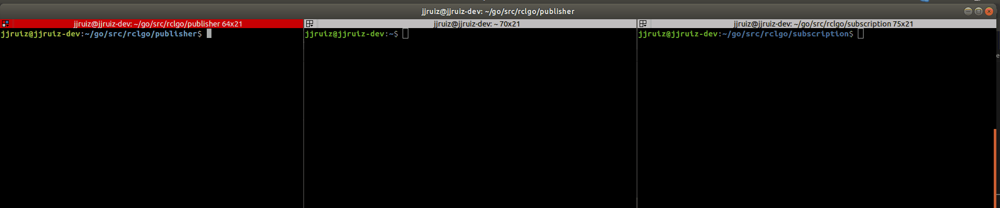

# rclgo

The goal of this repository is to create a wrapper using cgo for the C library developed for the upcoming ROS2 using the ROS Client Libraries API (RCL)

**ADVICE**: This project is **under development**. It is not totally functional yet.

# Update - this is being ported to ROS2 Eloquent


## Available functionality

Some basic behaviors such as creating a Node, a Publisher or a Subscriber have been already implemented. For messages, only the std_msgs/String has been implemented by now. In principle, it is intended to generate custom messages with C generator and bind our own types later in go. For the generation of messages, templates and go generate will be used.



## Repository structure
Following the structure of the [RCL API](http://docs.ros2.org/latest/api/rcl/index.html), the library in go has been organized following the ROS2 concepts. Each concept correspond to a go package.

The goal of this repository is to be as closed as possible to the official C API. When binding is complete, a good option would be to bind this rclgo library with more native/complex behavior (or even with new types/interfaces)

## Running the example
Recently, a working Dockerfile and a docker-compose file have been added to the repo. To get the previous example working, just run:

```
docker-compose build && docker-compose up 
```

Since containers are using the bridge mode (172.17.0.1 virtual subnet by docker), if we have ros2 already install in the host, just open a terminal and check the nodes and topics:

```
ros2 topic list
```

## Pre-requisites

cgo is used for the library wrapping. Temporarly, it is assumed that you have ros eloquent installed in:

```
/opt/ros/eloquent
```

This is a temporarly solution and it will be changed in the future. A more elegant solution would be to use an enviromental variable to point the library to the proper location.


